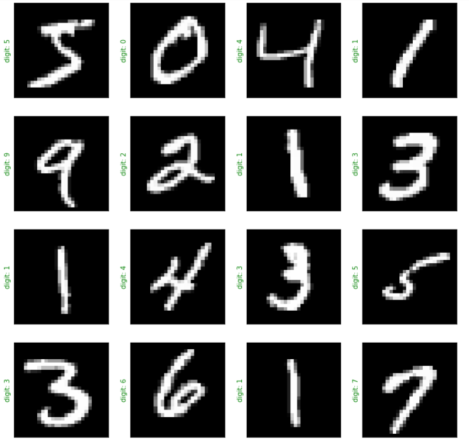
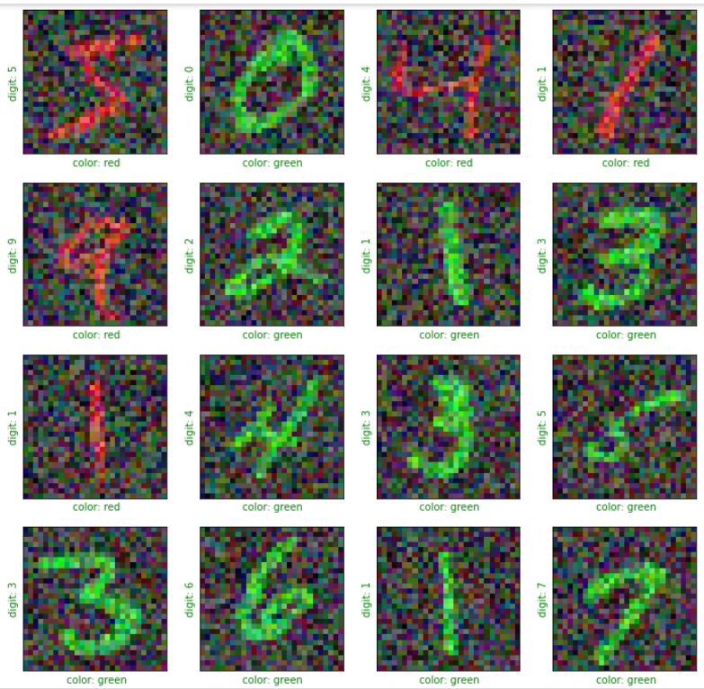
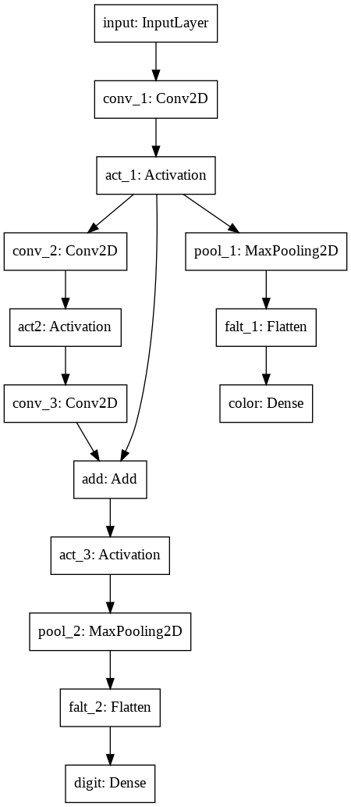
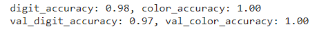
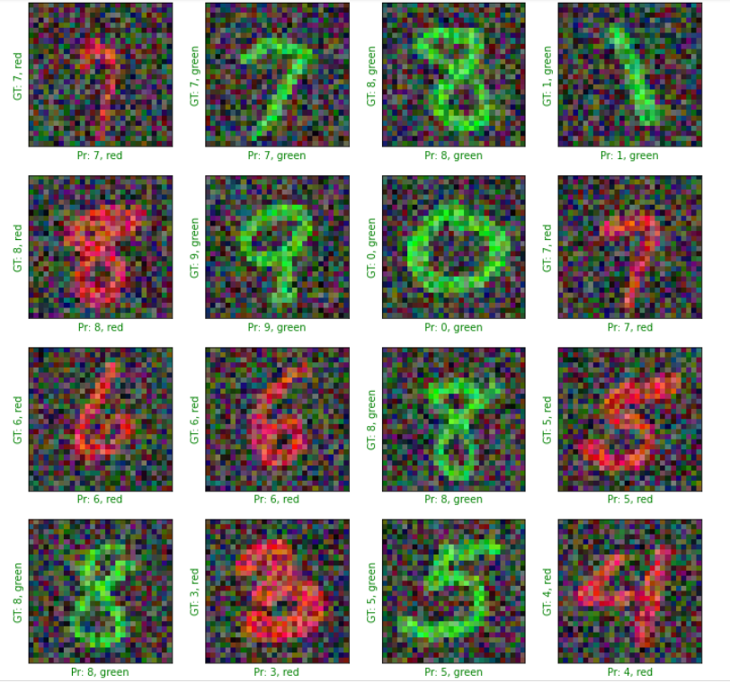

# MULTI TASK MODEL USING KERAS
## CODE:

## Problem Statement

This project aims at presenting a model to do 2 task simultaneously. 
Task 1 : Recognize the hand drawn digit  
Task 2 : Identify the color of the hand drawn digit

## OUR MODEL:
## DATA SET:
* <a href="http://yann.lecun.com/exdb/mnist/" target='_blank'> THE MNIST DATABASE of handwritten digits </a>
* The MNIST database of handwritten digits, available from this page, has a training set of 60,000 examples, and a test set of 10,000 examples. It is a subset of a larger set available from NIST. The digits have been size-normalized and centered in a fixed-size image.

## PHOTO DATA PREPARATION:

* The Original dataset was of hand-written digits in gray scale as shown:

* Modified the existing data to have noise and the digits to be in Red or Green as shown:

## MODEL
## ARCHITECTURE

## Accuracy:

## PREDICTIONS:

* GT for Ground Truth
* PR for predictions

